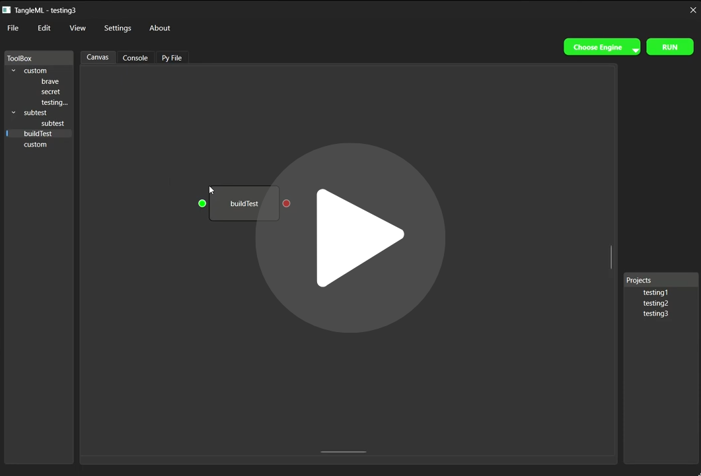

---
# TangleML

<p align="center"><b>Project Demo Video</b></p>
<p align="center">
<a href="https://youtu.be/LwIuaIKn9ag">

</a>
</p>


**Experimental Visual Machine Learning IDE built with C++ & Qt**

tangleML is an **experimental IDE** designed to simplify machine learning workflows by **visualizing the flow of information** and reducing repetitive code. Inspired by Blender’s node system, it allows users to **drag-and-drop boxes, connect them, and automatically generate Python code**.
---

**Underlying engine (work in progress):**
TangleMl was supposed to have its own basic engine but unfortunately repository for the experimental engine: [TangleML engine](https://github.com/6Asahi9/TangleML-Test) is currently incomplete.

---

## Table of Contents

- [Features](#features)
- [Experimental Status & Limitations](#experimental-status--limitations)
- [Acknowledgements](#acknowledgements)
- [Installation](#installation)
- [Usage](#usage)
- [Future Plans](#future-plans)
- [License](#license)

---

## Features

- **Drag-and-drop workflow**: Add boxes from the toolbox to the canvas and connect pointers to define data flow.
- **Canvas → Python file sync**: Saving a project updates the Python file with the code represented by the boxes. (Ctrl+S)
- **Run small code snippets**: Test code in the Python file without affecting the canvas setup.
- **Console with dual output**:
  - Upper area: standard print/log output.
  - Lower area: images and graphs (e.g., from matplotlib).

- **Reusable custom boxes**: Create permanent custom nodes via the menu bar (`File → Add File`) for code that can be reused across projects.
- **Temporary inline code box**: Drag the **custom box** onto the canvas, (`double-click it`), and write temporary code directly inside the node.
- **Rapid ML prototyping**: Quickly create workflows without rewriting boilerplate ML code.

---

## Experimental Status & Limitations

**tangleML is experimental and incomplete:**

- Projects **cannot be reopened** in tangleML once closed (Python files remain accessible).
- Most **menu bar functions are placeholders**.
- **Toolbox templates for common ML tasks** are not included yet.
- No **logo, branding, or polished UI**.
- Only basic **box connections and Python code generation** are functional.

---

## Acknowledgements

Development of tangleML was supported by [ChatGPT](https://chatgpt.com/), which assisted with debugging, code structure, and logic design throughout the project.

---

## Installation

1. Clone the repository:

   ```bash
   git clone https://github.com/6Asahi9/Tangle-UI.git
   ```

2. Open the project in **Qt Creator** or **Vscode**.
3. Then build and Run `cd/ build` , `TangleML-UI`.

---

## Usage

1. Drag boxes from the **toolbox** to the **canvas**.
2. Connect pointers to define data flow.
3. Write small code snippets in the **Python file** tab and run them.
4. Save (`Ctrl+S`) to sync canvas boxes to the Python file.
5. Use **custom boxes** for reusable code snippets via the menu bar.

---

## Future Plans

- Support for **saving and loading projects**.
- Predefined **ML toolbox templates**.
- Node **property editor** for enhanced customization.
- Polished **UI/UX with logo and themes**.

---

## Contributing

Contributions are welcome! Since this is an experimental IDE, please:

- Report bugs or limitations in the **Issues** section.
- Suggest new features or improvements.
- Submit pull requests with clear descriptions of changes.

---

## License

This project is **experimental** and intended for learning and prototyping purposes. Not for commercial use.
